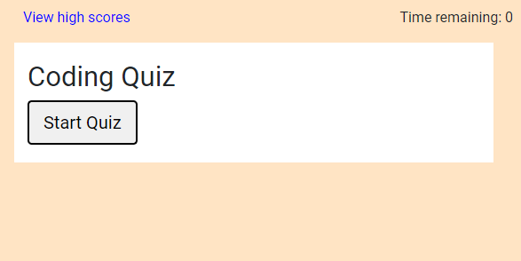
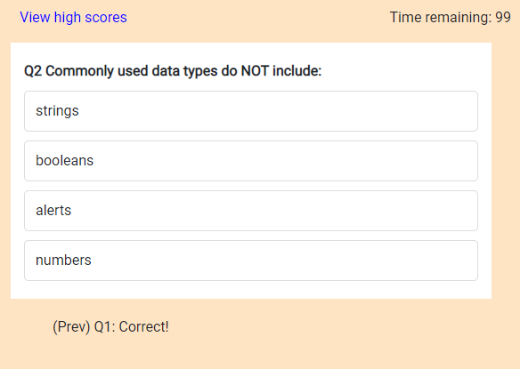
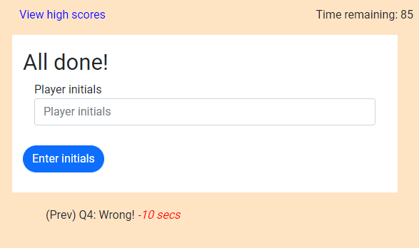
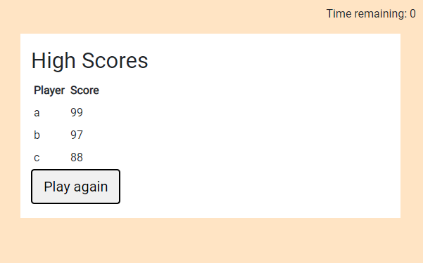

# 04 Web APIs: Code (Javascript) Quiz

> Repository URL: https://github.com/ptrcao/04-Web-APIs-02-Challenge.git

> Web app URL: https://ptrcao.github.io/04-Web-APIs-02-Challenge/

## Project Description
This Javascript interactive web app makes use of Web APIs, Javascript and JQuery to provide the user with a fun tool for testing their knowledge of Javascript.  The underlying code includes:

* a custom function which sorts the player high scores table by descending order on score.
* various event listeners which dynamically generate the questions, multiple choice options, and high scores on a blank HTML template, manage the countdown timer, and hide/show relavant cards at various stages in the quiz
* use of localStorage web API to fetch and push new scores to the browser, to enable a high scores history function

## Acceptance Criteria

> GIVEN I am taking a code quiz WHEN I click the start button THEN a timer starts and I am presented with a question

&#10004; Implemented

> WHEN I answer a question THEN I am presented with another question 

&#10004; Implemented

> WHEN I answer a question incorrectly THEN time is subtracted from the clock

&#10004; Implemented (10 secs is deducted)

> WHEN all questions are answered or the timer reaches 0 THEN the game is over

&#10004; Implemented

> WHEN the game is over THEN I can save my initials and my score

&#10004; Implemented

## Screenshots

